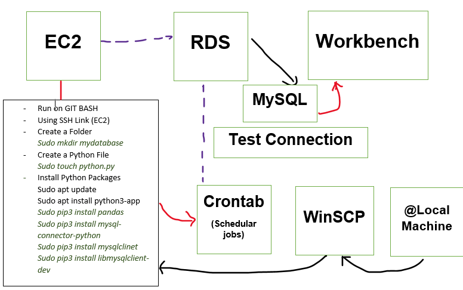

# AWS Instructions For Setup 
  - Running Cron Job on Linux inside AWS(EC2).
  - Extracting the data from API using Request Library in Python.
  - Setting Up MySQL Database inside RDS on AWS
  - Using WorkBench to Access the data for MySQL 

1. Setting up Instance(EC2) inside AWS.
- use this video to setup the Instance: https://www.youtube.com/watch?v=qUHQuZjTOFA&ab_channel=DataScienceGarage
- Make sure you save the file on computer 

2. Setting up RDS inside AWS and Connect to MySQL inside WorkBench.
- https://www.youtube.com/watch?v=Ng_zi11N4_c&ab_channel=BeABetterDev
- You Need Hostname and Master UserName from RDS to Connect(AWS)

3. Create a table inside MySQL 
- So, we can upload the data from API to MySQL Table.

4. Create a Python Script for API 
- Use request Library to Extract the Data
- Pandas Library to Clean the Data
- SQLAlchemy Library to connect with MySQL Database and Upload the data  

5. Use Git Bash to access the EC2 (Instance)
- When Connecting you need to be in the right folder where the Private Key was saved.
- Need SSH URL from AWS to Connect 
- Download all Python Packages 
- Create a new Folder and Python File with API Script 
- Set up Crontab Job

6. Setting up WinSCP
- This allows you to move files from Local Machine to AWS
- Watch this Video: https://www.youtube.com/watch?v=asHj7ANyzm4&ab_channel=HyperBall
- Need .ppk File to connect

